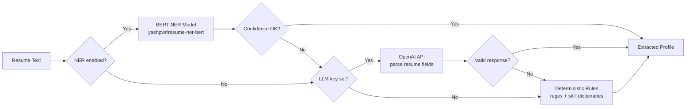
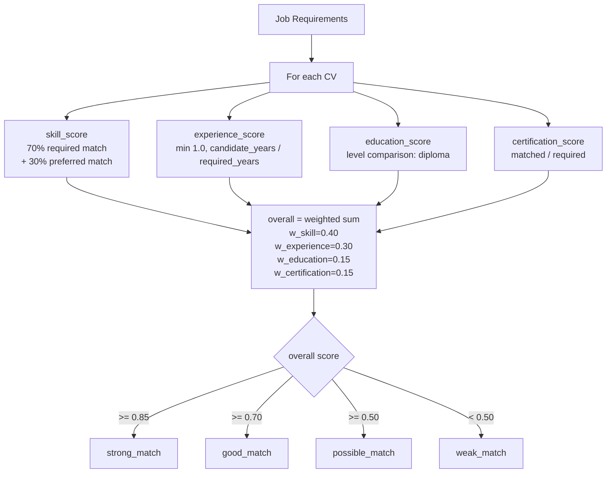
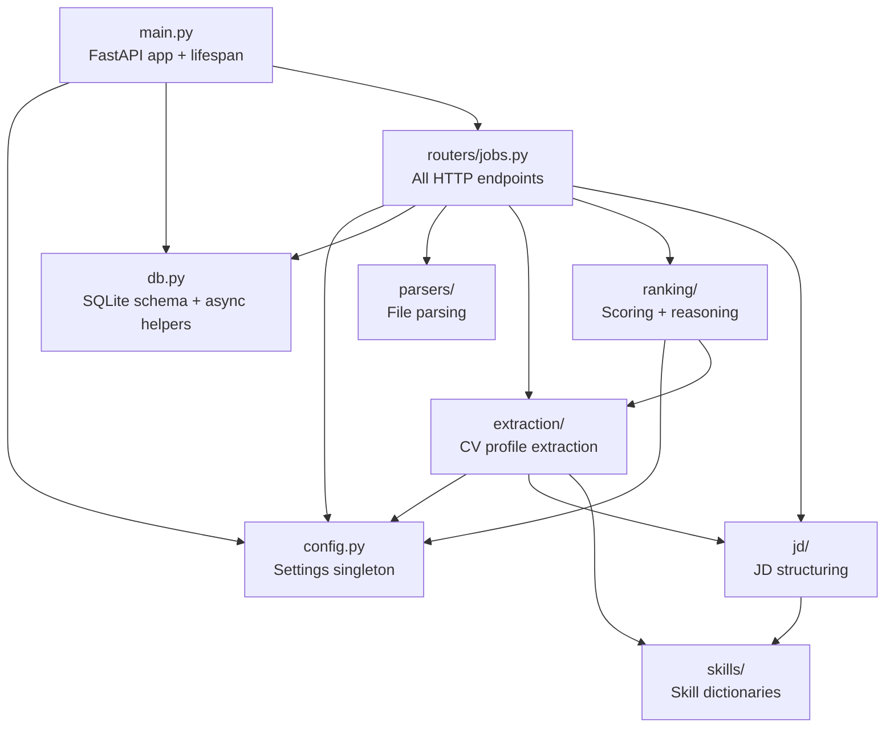
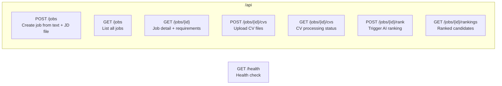

# Backend Architecture Flow

## End-to-End Data Flow

```mermaid
flowchart TD
    subgraph Upload_JD["1. Create Job (POST /api/jobs)"]
        A[User uploads JD\nPDF/DOCX/TXT or pastes text]
        A --> B[parsers.extract_text]
        B --> C[jd.structure_jd\nrule-based parsing]
        C --> D[(SQLite: jobs table)]
    end

    subgraph Upload_CVs["2. Upload CVs (POST /api/jobs/{id}/cvs)"]
        E[User uploads CV files]
        E --> F[parsers.extract_text\nPDF/DOCX/TXT]
        F --> G{Extraction Pipeline\nextraction.extract_profile_text}

        G -->|1. NER enabled?| H[extraction._ner\nlocal BERT model]
        G -->|2. LLM key set?| I[extraction._orchestrator\nOpenAI API]
        G -->|3. Fallback| J[extraction._profile\nregex + dictionaries]

        H --> K[Profile dataclass\ncandidate_name, skills,\nyears, education, certs]
        I --> K
        J --> K

        K --> L[(SQLite: cvs table\nstatus=parsed)]
    end

    subgraph Ranking["3. Rank Candidates (POST /api/jobs/{id}/rank)"]
        M[Trigger ranking]
        M --> N[ranking.score_profile\nrule-based scoring]

        N --> O{LLM enabled?}

        O -->|Yes| P[ranking._llm\nOpenAI API\nper-candidate reasoning]
        P --> Q[Update overall score,\nrecommendation, explanation\nfrom LLM]

        O -->|No| R[ranking.rule_reasoning\ndeterministic text]

        N --> S[Compute sub-scores:\nskill_score, experience_score,\neducation_score, cert_score]

        S --> T[(SQLite: cvs table\nscores, bucket,\nrecommendation)]
        Q --> T
        R --> T
    end

    subgraph Results["4. View Rankings (GET /api/jobs/{id}/rankings)"]
        U[Frontend queries rankings]
        U --> V[Sorted by overall_score DESC]
    end
```

## Extraction Pipeline Detail

## Ranking Scoring Detail

## Module Dependencies

## API Endpoints

## Storage

| Table | Purpose | Key Columns |
|-------|---------|-------------|
| `jobs` | Job vacancies | id, title, description, requirements (JSON), status |
| `cvs` | Candidate CVs + scores | id, job_id (FK), file_name, storage_path, status, skills (JSON), overall_score, bucket, recommendation |
