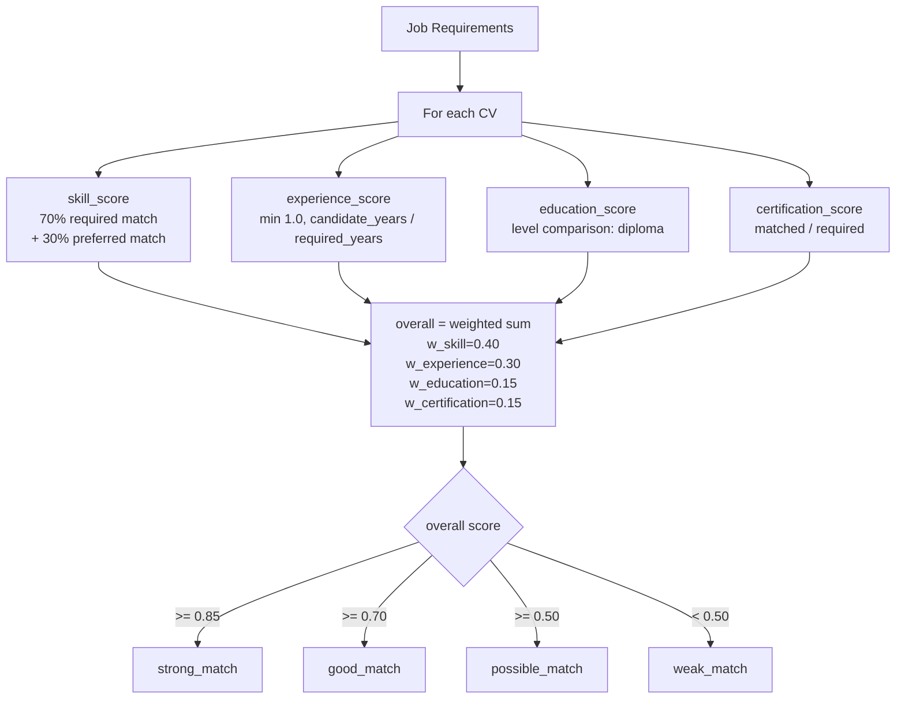
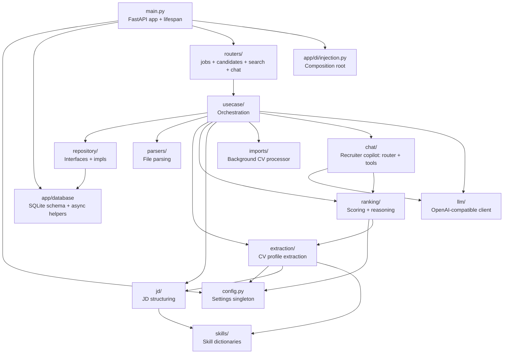

# Backend Architecture Flow

## End-to-End Data Flow

```mermaid
flowchart TD
    subgraph Upload_JD["1. Create Job (POST /api/jobs)"]
        A[User uploads JD\nPDF/DOCX/TXT or pastes text]
        A --> B[parsers.extract_text]
        B --> C[jd.parser + jd.structure\nrule-based parsing]
        C --> D[(SQLite: jobs table)]
    end

    subgraph Upload_CVs["2. Import CVs (POST /api/jobs/{id}/candidates/import)"]
        E[User uploads CV files] --> F[usecase.ImportCvBatch]
        F --> G[Files saved to disk\n+ queued rows in cvs table status=uploaded]
        G --> H[import_jobs row created/updated\nstatus=uploading]
        F -->|202, returns import_id| I[Frontend shows progress overlay]
        H --> J[Background: imports.CvProcessor\nasyncio worker pool, DB-as-queue]
        J --> K{Extraction Pipeline\nextraction.extract_profile_text}

        K -->|1. NER enabled?| L[extraction._ner\nlocal BERT model]
        K -->|2. LLM key set?| M[extraction._orchestrator\nOpenAI-compatible API]
        K -->|3. Fallback| N[extraction._profile\nregex + dictionaries]

        L --> O[Profile dataclass\ncandidate_name, skills,\nyears, education, certs]
        M --> O
        N --> O

        O --> P[(SQLite: cvs table\nstatus=completed, source=ner|llm|rules)]
        P --> Q[import_jobs progress updated\nprocessed/failed counts]
    end

    subgraph Ranking["3. Rank Candidates (POST /api/jobs/{id}/rank)"]
        R[Trigger ranking] --> S[ranking.service\nrule-based scoring]

        S --> T{LLM enabled?}
        T -->|Yes| U[ranking._llm\nper-candidate reasoning]
        U --> V[Update overall score,\nrecommendation, explanation]
        T -->|No| W[ranking._scoring\nrule_reasoning deterministic text]

        S --> X[Sub-scores: skill, experience,\neducation, certification]
        X --> V
        V --> Y[(SQLite: cvs table\nscores, bucket, recommendation, ranked_at)]
        W --> Y
    end

    subgraph Results["4. View Rankings (GET /api/jobs/{id}/rankings)"]
        Z[Frontend queries rankings] --> AA[Sorted by overall_score DESC]
    end
```

## Extraction Pipeline Detail


## Ranking Scoring Detail



## Module Dependencies



## API Endpoints

```mermaid
flowchart LR
    subgraph API["/api"]
        POST_JOB["POST /jobs\nCreate job from text + JD file"]
        GET_JOBS["GET /jobs\nList all jobs (paginated)"]
        SEARCH_JOBS["GET /jobs/search?keyword=\nSearch jobs"]
        GET_JOB["GET /jobs/{id}\nJob detail + requirements"]
        DELETE_JOB["DELETE /jobs/{id}\nDelete job + CVs + files"]
        IMPORT_CVS["POST /jobs/{id}/candidates/import\nBatch-upload CVs (async)"]
        IMPORT_STATUS["GET /jobs/{id}/imports/{import_id}\nImport progress"]
        GET_CVS["GET /jobs/{id}/cvs\nCV processing status"]
        DELETE_CV["DELETE /jobs/{id}/cvs/{cv_id}\nDelete one candidate"]
        POST_RANK["POST /jobs/{id}/rank\nRank all candidates"]
        POST_RANK_CV["POST /jobs/{id}/cvs/{cv_id}/rank\nRank one candidate"]
        GET_RANK["GET /jobs/{id}/rankings\nRanked candidates"]
    end

    subgraph SEARCH["/api"]
        SEARCH_CANDIDATES["GET /candidates/search?keyword=\nSearch candidates (all jobs)"]
        UNIFIED["GET /search?keyword=\nUnified jobs + candidates search"]
        SEMANTIC["POST /search/semantic\nSemantic search (RAG, opt-in)"]
        REINDEX["POST /search/reindex\nRebuild vector index (RAG, opt-in)"]
    end

    subgraph CHAT["/api"]
        CHAT_MODELS["GET /chat/models\nAvailable copilot models"]
        CHAT["POST /chat\nRecruiter copilot Q&A"]
        CHAT_STREAM["POST /chat/stream\nSSE streaming chat"]
    end

    HEALTH["GET /health\nHealth check"]
```

## Storage

| Table | Purpose | Key Columns |
|-------|---------|-------------|
| `jobs` | Job vacancies | id, title, description, requirements (JSON), status, jd_file |
| `cvs` | Candidate CVs + scores | id, job_id (FK, CASCADE), import_job_id (FK, SET NULL), file_name, storage_path, status, skills (JSON), overall_score, bucket, recommendation, source |
| `import_jobs` | CV batch import progress | id, job_id (FK, CASCADE), total/uploaded/processed/failed_files, status, completed_at |
